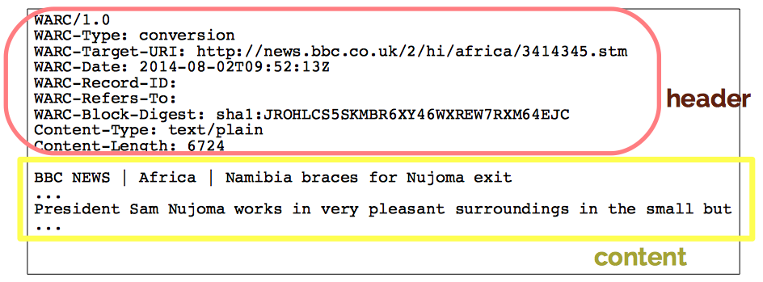
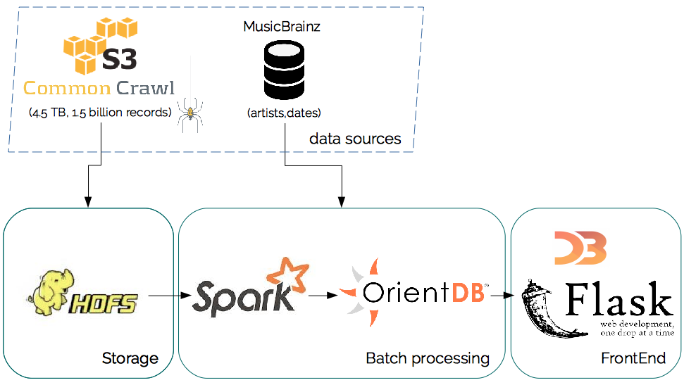

# musiclopedia
[Musiclopedia](http://musiclopedia.info) is my big data project as part of [Insight Data Science](http://insightdatascience.com/)'s Engineering Fellowship program from September 2015 through October 2015.

> <b>NOTE:</b> The [Insight Data Engineering Fellows Program](http://insightdataengineering.com/) for the 2015 fall session has officially ended. 
 
As of <b>October 25, 2015</b>, the servers used to run the pipeline for the [Musiclopedia](http://musiclopedia.info) site have been shut down, so many of the components will not work as expected. 
 
Please see the screencast [here](https://www.youtube.com/watch?v=Via8603m3Iw) to watch the demo when it was live.

## What is Musiclopedia?
It is a tool for finding influence between musical artists. It works by looking at references of artists in web crawl logs published by [CommonCrawl](http://commoncrawl.org/), and building a graph database that interconects two artists when these are mentioned in a number of common websites. Currentlty, it only support Jazz musicians, as the challenge of disambiguating their names is easier since these are typically very unique (for example, [Cannonball Adderley](https://en.wikipedia.org/wiki/Cannonball_Adderley))

## Motivation
The purpose of the project is to gain experience in processing large amounts of data - the *volume* in the three V's (volume, velocity, variety).
The end product might be interesting for music lovers and as a new source for reccomendation engines, since it mines on valuable information that music experts and systems post on the internet.

## Intro
**Musiclopedia** is an open-source data pipeline which extracts and processes [Common Crawl](http://commoncrawl.org)'s web corpus, finding relationships between members of a list of artists extracted from the MusicBrainz Databases. To do this, it leverages the following technologies:

- Big Data Pipeline
    - AWS EC2 and S3
    - Apache Hadoop
    - Apache Spark
    - Orient DB
- Front End
    - Flask
    - jQuery
    - D3

## Live Demo
A live demo is currently (October 2015) running at [http://musiclopedia.info:5000](http://musiclopedia.info:5000)

## The Data
The data comes from the [Common Crawl](http://commoncrawl.org)'s July 2015 web corpus. The corpus is ~168TB, but for this project, a subset of this data was processed, roughly 1TB.

The files are available in Common Crawl's public AWS S3 bucket as gzipped WET file formats. A WET file contains a header for the whole file, and a header and an extracted text body  (without HTML tags) of each request and web page used and found during the crawl:

The artist list was obtained from the [MusicBrainz database](https://musicbrainz.org/doc/MusicBrainz_Database) by querying the ones with the 'jazz' tag.

## Pipeline Overview

The WET files were processed through a traditional ETL process, but in a distributed manner. The [Spark](https://spark.apache.org) driver was responsible for downloading a gzipped WET file, which was parsed into separate records to be processed by each eorker separately. The process involved comparing a record's text with each entry of the artist list, saving to a [HDFS](http://hadoop.apache.org) CSV files with (url,artist) pairs indicating the matches found. 

A subsequent batch process loaded the CSV files into a distributed [OrientDB graph database](http://orientdb.com/orientdb/), adding vertices for the Artists and Urls, and Edges for the connections between these. From these schema, views were calculated to establish connections between artists based on the statstics of the whole graph. 

The results from these views are stored in the same database as a new type of Edge, which are served using [Flask](http://flask.pocoo.org), [jQuery](https://jquery.com) and [D3](http://d3js.org) to a web server.

## Presentation Deck
Slides are available on [Slideshare](http://www.slideshare.net/PabloRecabal/pablo-recabal-week4demo).

